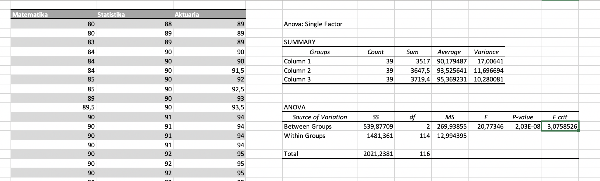

Pengolahan data dilakukan dalam Microsoft Excel. File excelnya dapat diakses pada https://github.com/drepram/college/blob/main/sem1/psd/assignment10/computation.xlsx

Mengai tahapan pembersihan data atau data cleansing, pada tugas sebelumnya (Assignment 9) kami menggunakan 507 baris dari data tanggapan yang kami telah diberikan akses untuk digunakan (https://bit.ly/DataPSD) serta telah kami bersihkan juga. 

Pada tugas kali ini, kami melakukan hipotesa antara mahasiswa-mahasiswa antar prodi yang berada pada departemen Matematika. Mahasiswa Prodi S1 Aktuaria mempunyai sebanyak 43 mahasiswa, S1 Statistika mempunyai sebanyak 51, S1 Matematika mempunyai sebanyak 62 mahasiswa.

Karena kami hendak melakukan "One-way analysis of variance", perlu dinyatakan ulang bahwa *hasil ANOVA satu arah dapat dianggap andal/reliable selama asumsi berikut terpenuhi:*

- Response variable residuals are normally distributed (or approximately normally distributed).
- Variances of populations are equal.
- Responses for a given group are independent and identically distributed normal random variables (not a simple random sample (SRS)).

Dikarenakan poin ke 2, kami menyesuaikan banyak mahasiswa dari statistika dan matematika agar bertepatan dengan jumlah mahasiswa dari prodi akturia, yakni 43 entri.

---

Mengutip https://sphweb.bumc.bu.edu/otlt/MPH-Modules/BS/BS704_HypothesisTesting-ANOVA/BS704_HypothesisTesting-ANOVA2.html: **The null hypothesis in ANOVA is always that there is no difference in means. The research or alternative hypothesis is always that the means are not all equal and is usually written in words rather than in mathematical symbols.**

Hipotesa kami adalah:
- Hipotesa null: Tidak ada perbedaan mean antara Nilai Matematika Prodi Matematika, Statistika, dan Aktuaria.

- Hipotesa alternatif: Ada perbedaan mean antara Nilai Matematika Prodi Matematika, Statistika, dan Aktuaria.

Data kami adalah sebagai berikut:
```
Table columns (Mathematics, Statistics, Actuary) in the forms of an array:

The mathematics study program has 39 items, which are: [
  80,   80,   83, 84, 84, 84, 85, 85,
  89, 89.5,   90, 90, 90, 90, 90, 90,
  90,   90, 90.5, 91, 91, 91, 92, 92,
  92,   92,   92, 93, 93, 93, 94, 94,
  94,   94,   95, 95, 95, 95, 95
]

The statistics study program has 39 items, which are: [
  88, 89, 89, 90,   90, 90,  90, 90,
  90, 90, 91, 91,   91, 91,  92, 92,
  92, 92, 92, 93,   93, 93,  95, 95,
  95, 95, 95, 96, 96.5, 97,  97, 97,
  97, 97, 99, 99,   99, 99, 100
]

The actuary study program has 39 items, which are: [
  89,   89, 89, 90, 90, 91.5,   92, 92.5,
  93, 93.5, 94, 94, 94,   94,   95,   95,
  95,   95, 96, 96, 96, 96.4, 96.5,   97,
  97,   97, 97, 97, 98,   98,   98,   99,
  99,   99, 99, 99, 99,  100,  100
]

Total items: 117
Significance level (α): 0.05
```

Dari data seperti berikut, kita olah datanya dengan Microsoft Excel dan kita dapati: 



- nilai `F-test` bernilai 20,77346023
- nilai `P-value` bernilai 2,02991E-08 atau 0.0000000202991

Untuk menentukan jika kita menerima H<sub>0</sub> atau kita menolak H<sub>0</sub>, perlu kita ingat bahwa: 

- If F ≥ F<sub>Critical</sub>, the null hypothesis is rejected.
- The null hypothesis is rejected if this probability is less than or equal to the significance level (α).

**Bisa kita lihat bahwa 20,77346023 ≥ 3,075852636 dan 0.0000000202991 ≤ 0.05**

Maka dengan penemuan tersebut, kami menolak H<sub>0</sub>. 


###### Sidenote: Saya mohon maaf jika pengerjaan tugas kali ini kurang informatif jika dibandingkan dengan pengerjaan tugas sebelum-sebelumnya.