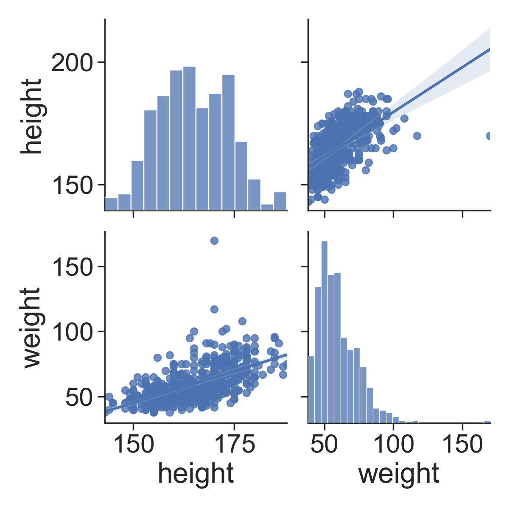
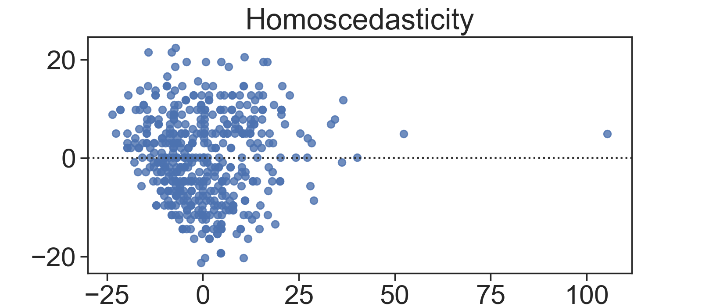
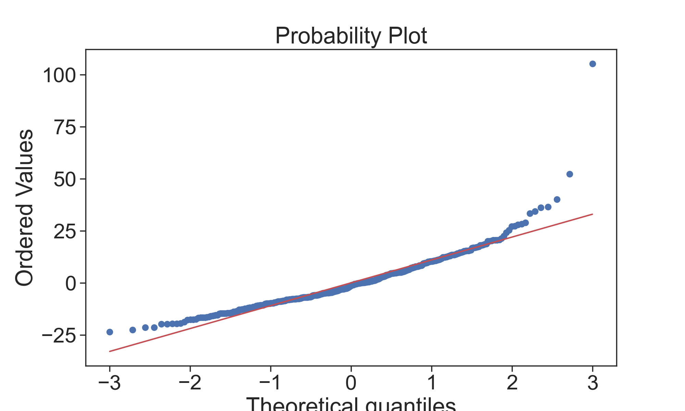
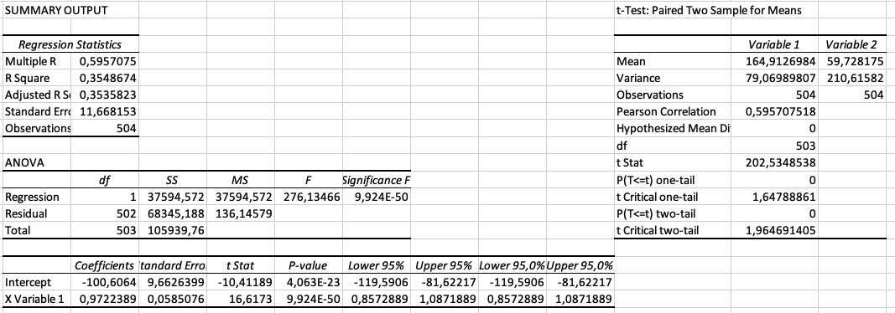

# Assignment 11

Pengolahan data dilakukan oleh `Andre Christoga Pramaditya (drepram.com) dengan NPM 2006570006` dalam Microsoft Excel dan Python. 

File excelnya dapat diakses pada https://github.com/drepram/college/blob/main/sem1/psd/assignment11/computation.xlsx dan juga codebase yang terkait dengan pengerjaan tugas kali ini pada https://github.com/drepram/college/tree/main/sem1/psd/assignment11.

From our Python code (with the help of numpy, matplotlib, and pandas.) we receive the following graphics:

<hr>

<hr>

<hr>

<hr>

## Print out
```          height    weight
height  1.000000  0.595708
weight  0.595708  1.000000
                            OLS Regression Results                            
==============================================================================
Dep. Variable:                 weight   R-squared:                       0.355
Model:                            OLS   Adj. R-squared:                  0.354
Method:                 Least Squares   F-statistic:                     276.1
Date:                Wed, 30 Dec 2020   Prob (F-statistic):           9.92e-50
Time:                        01:07:52   Log-Likelihood:                -1952.4
No. Observations:                 504   AIC:                             3909.
Df Residuals:                     502   BIC:                             3917.
Df Model:                           1                                         
Covariance Type:            nonrobust                                         
==============================================================================
                 coef    std err          t      P>|t|      [0.025      0.975]
------------------------------------------------------------------------------
Intercept   -100.6064      9.663    -10.412      0.000    -119.591     -81.622
height         0.9722      0.059     16.617      0.000       0.857       1.087
==============================================================================
Omnibus:                      279.723   Durbin-Watson:                   1.846
Prob(Omnibus):                  0.000   Jarque-Bera (JB):             4149.880
Skew:                           2.076   Prob(JB):                         0.00
Kurtosis:                      16.430   Cond. No.                     3.07e+03
==============================================================================

Notes:
[1] Standard Errors assume that the covariance matrix of the errors is correctly specified.
[2] The condition number is large, 3.07e+03. This might indicate that there are
strong multicollinearity or other numerical problems.
```

## There are four assumptions associated with a linear regression model:

1. Linearity: The relationship between X and the mean of Y is linear.
1. Homoscedasticity: The variance of residual is the same for any value of X.
1. Independence: Observations are independent of each other.
1. Normality: For any fixed value of X, Y is normally distributed.

### Linearity
> The relationship between height and weight must be linear.

The scatterplot shows that, in general, as height increases, weight increases. There does not appear to be any clear violation that the relationship is not linear.

### Independence of errors
> There is not a relationship between the residuals and weight

In the residuals versus fits plot, the points seems to not be randomly scattered, and it does appear that there is a relationship.

### Normality of errors
> The residuals must be approximately normally distributed.

Most of the data points fall close to the line, but there does appear to be a slight curving. There is one data point that clearly stands out.

### Homoscedasticity (Equal variances) 
> The variance of residual is the same for any value of X 

In the following plot above, it can be clearly seen that there is a pattern.

---

We now present our calculation via Microsoft Excel.


<br>

The coefficient of determination, $R^2$ is $0,3548$ or $35.48\%$. This value means that $35.48\%$ of the variation in weight can be explained by height.   

Regression equation:
$\text{weight} = -100,6 + 0,97(\text{height})$

The slope is $0,97$, and the intercept is $-100,6$. The test for the slope has a p-value of less than 0.001. 

Therefore, with a significance level of 5%, we can conclude that there is enough evidence to suggest that height is a significant linear predictor of weight. We should make this conclusion with caution, however, since some of our assumptions (**LINE: Linearity, Independence of Errors, Normality of Errors, Equal Variances**) are not valid.

Recall that the confidence interval for the population slope is: $\hat{\beta}_{1} \pm t_{\alpha / 2} \hat{S E}\left(\hat{\beta}_{1}\right)$

The estimate for the slope is $0,97$ and the standard error for the estimate (SE Coef in the output) is $0,058$. There are  observations, so the degrees of freedom are $n-2 \implies 504-2 \implies DoF = 502$. Using Excel, we find the t-value to be: $1,964$.

$$
0,97 \pm 1,964(0,058) \implies (0.85, 1.08)
$$

With the formula above, we could state that: We are 95% confident that the population slope is between $0.85$ and $1.08$. 

In other words, we are 95% confident that, as height increases by one inch, that weight increases by between $0.85$ and $1.08$ pounds, on average.

Using the regression formula with a height equal to 153 cm, we get:

$\text{weight} = -100,6 + 0,97(153) \implies \text{weight} = 47,81$ kg

A student with a height of 153cm, we would expect a weight of 47,81 kilograms. If we wanted, we could have Minitab produce a confidence interval for this estimate. We will leave this out for this example.

And to conclude, the estimated standard deviation of the error: $s = 11,6681529075601$.