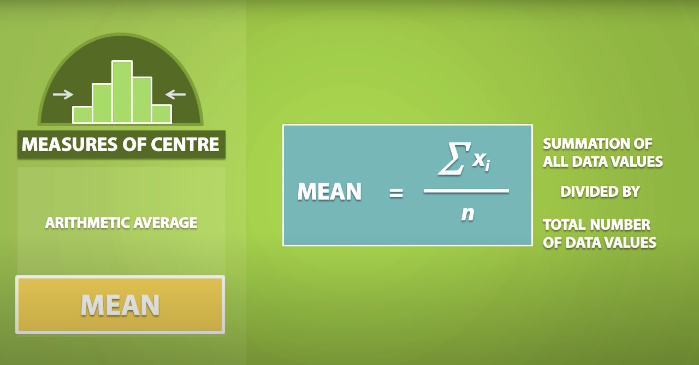
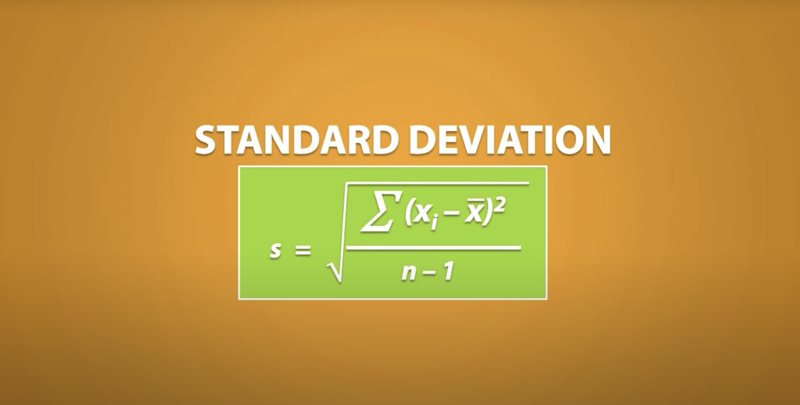
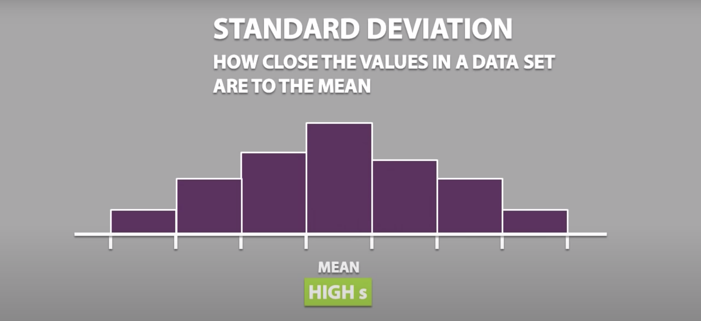
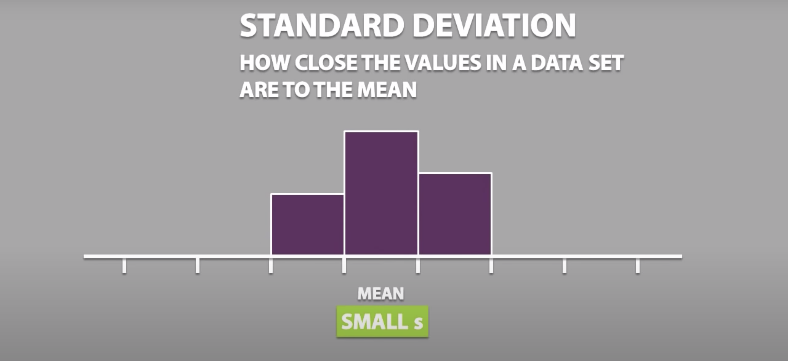
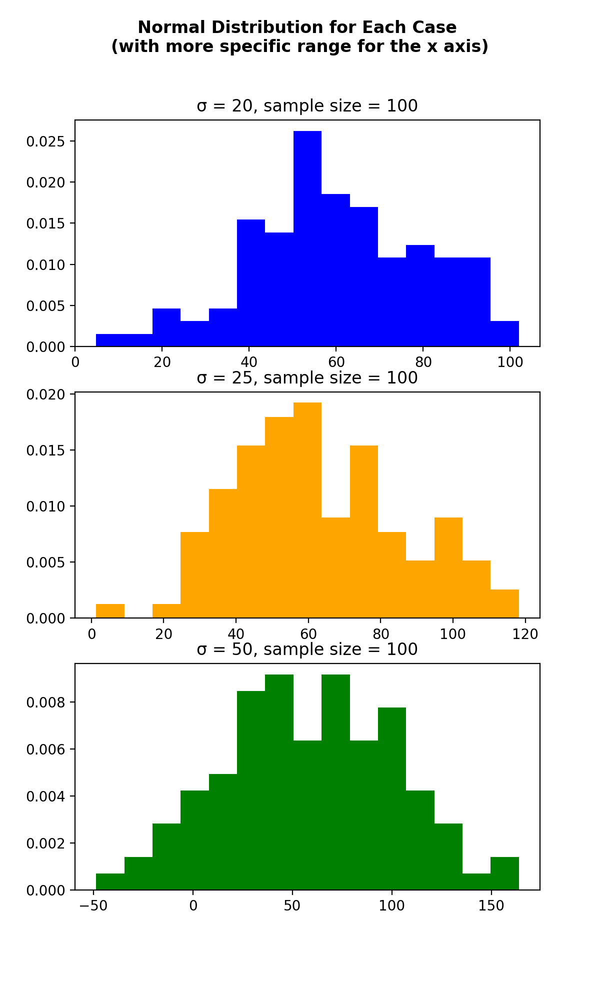
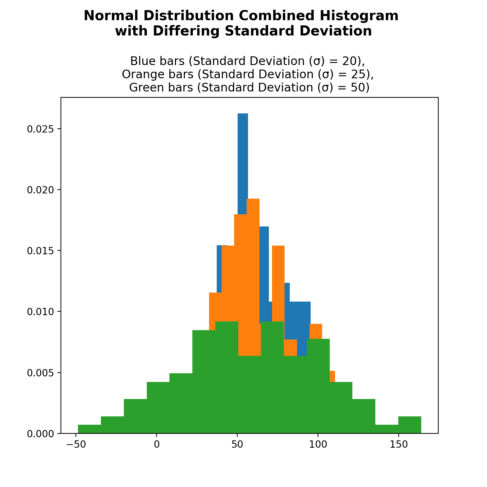

# Work on the second part of the seventh assignment
>  Pengerjaan Bagian 2 dari Tugas 7 PSD, FMIPA UI
```
Pengerjaan oleh Andre Christoga Pramaditya (2006570006)
```

This is part of the work on the seventh assignment of the Pengantar Sains Data (Introduction to Data Science) class at the Faculty of Mathematics and Natural Science of the University of Indonesia (FMIPA UI).

In this document, I will borrow the explanation given by Simple Learning Pro[^1] on the Measure of Spread that is the Standard Deviation, wherein it could also be written as $\sigma$.

In that particular video, it also tried to explain what the Measures of Centre are (Mode, Median, Mean) and what the Measures of Spread are (Range, Standard Deviation).

[^1]: Simple Learning Pro. (n.d.). Home [YouTube channel]. Retrieved November 26, 2020, from https://www.youtube.com/watch?v=mk8tOD0t8M0


## Definition of  $\bar{x}$

Before we lay the formula for Standard Deviation ($\sigma$), we must first see what x-bar ($\bar{x}$) mean.



Given a data set $\displaystyle X=\{x_{1},\ldots ,x_{n}\}$, the arithmetic mean (or mean or average), denoted $\displaystyle {\bar {x}}$.

If our mean comes from a sample, we would call it as x-bar or $\bar{x}$.

Now we can move on onto the formula for standard deviation.

## Standard Deviation Formula


Dimana:

- $n$ = banyaknya pengamatan di dalam pencaran frekuensi
- $x_i$ = titik tengah kelas ke-i.
- $x$ = harga rata-rata hitung dari pencaran frekuensi

Dari persamaan tersebut bisa dilihat dua hal yang akan terjadi berdasarkan nilai $s$.

> Note that the Greek letter sigma σ, is used for the population standard deviation, and the Latin letter s, is used for the sample standard deviation.

##### Ketika $\sigma$ Tinggi



##### Ketika $\sigma$ Rendah



---

From the images above, we can conclude that the higher the standard deviation is, the more spread out the data would be. And it woud be the other way around for when the standard deviation is small.

We would now move onto the graphics we have retrieved.

The graphics were generated with the help of Python 3, NumPy, and matplotlib.

## The Graphics




> I added another case of which the differing factor was solely its standard deviation value ($\sigma$ = 50) just so that I can show with more evidence what my conclusion is. I hope that is okay.

Menyatakan kembali konklusi saya di awal: 

> Deviasi standar yang rendah menunjukkan bahwa nilai-nilai cenderung mendekati mean. 

> Sedangkan jika deviasi standarnya tinggi, maka nilai-nilai tersebut akan tersebar pada rentang yang lebih luas.

